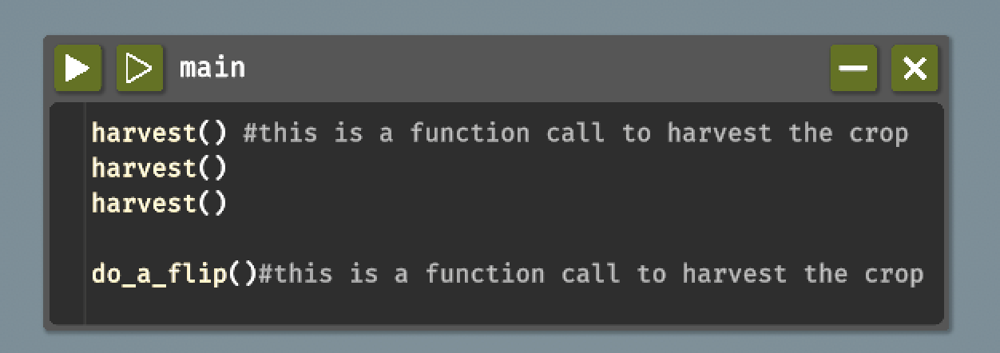
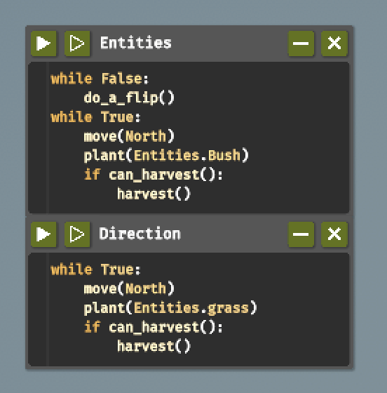
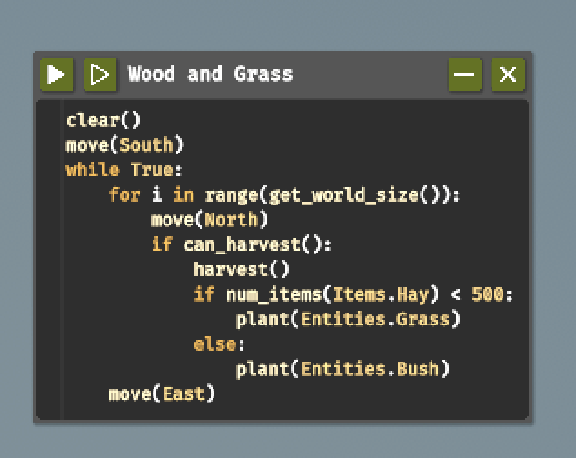
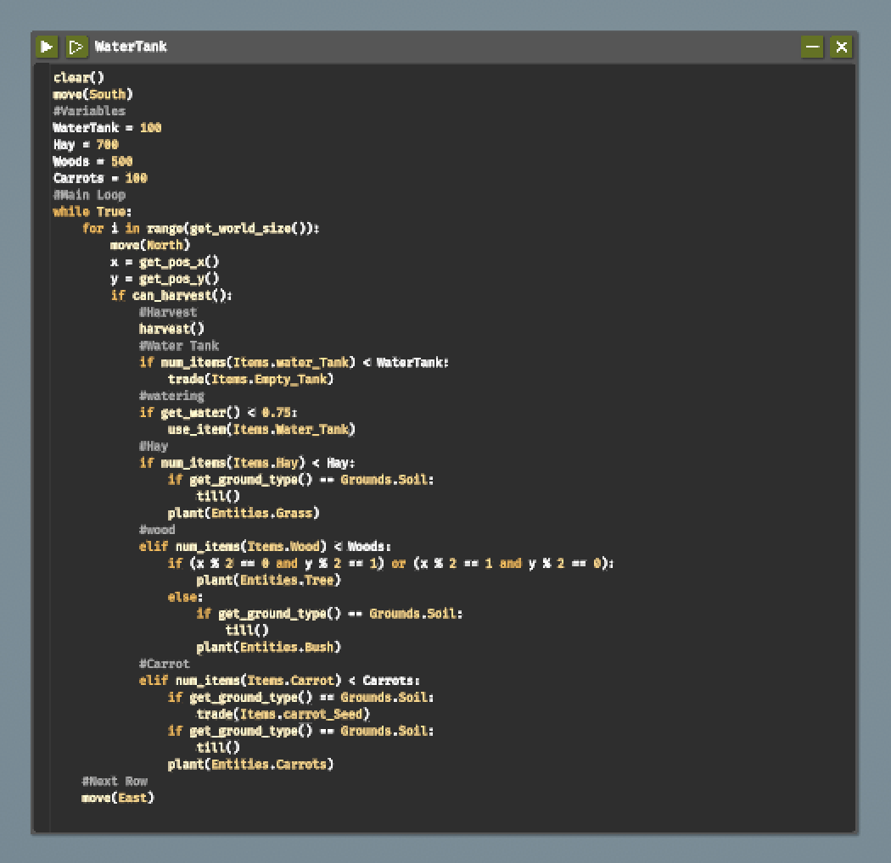
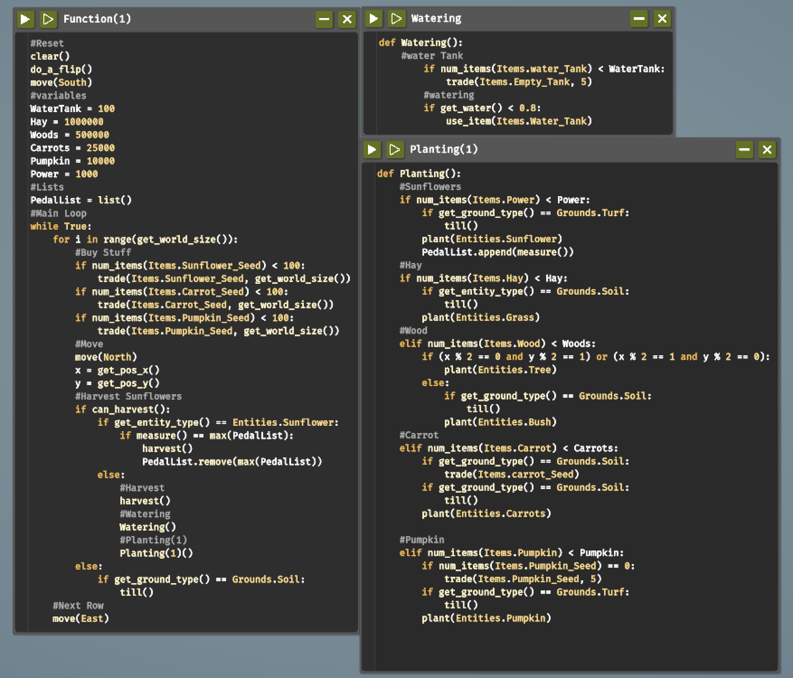

 # Programming the Farming Drone (Report)

 ## Introduction
The Farmer Was Replaced is a creative and strategic game fusing state-of-the-art automation technologies with traditional farming principles. At its core, it whisks players away to a farm where the most advanced drone has taken over primary agricultural tasks previously carried out by farmers. It is capable of hydrating plants, sowing crops, harvesting fields, and even applying fertilizer with precision on its own. While it might look like a standard agricultural simulation at first glance, the game deviates from that by incorporating elements of strategy and resource management. The player must, in a manner of speaking, spend money wisely to optimize and unlock new features and locations. The main point of the game is to optimize the drone's performance by collecting grass and other crops so that it can open up more land.

# Table of Contents
- [Code Snippets and Explanation](#code-snippets-and-explanation)
- [Challenges and Learnings](#challenges-and-learnings)
- [References](#references)

# Code-Snippets-and-Explanation

## Step 1: Farming on 1 tile
**Code:**
```python
while True:
    if can_harvest():
        harvest()
    else:
        do_a_flip():
        harvest()
```
       
**Explanation:**
This is an initial stage where one has to just collect enough hay to give a boost to drone's efficiency and other new features. The code makes a while loop; hence, there is an infinite loop when it continuously checks if the grass is ready to harvest. If the condition can_harvest() is true, then the drone will harvest the grass. It then does a flip, giving more time for grass to grow, and after that, it will look again. We delay the drone optimally with flips until enough hay is gathered to enable further upgrades.

**Demo:**
Image Demo:


**Notes**
- By using this code, I was able to collect enough hay to improve my drone's speed and boost my grass yield. Along with unlocking new features like planting shrubs and issuing movement commands, I was able to increase my tile count from one to three.
- Additional feature unlocked:
  plant(Entities.Bush), move().

## Step 2: Farming on 3x1 tile
**Code:**
```python
while False: 
    do_a_flip()
while True:
    move(North)
    plant(Entities.Bush/Grass)
    if can_harvest():
        harvest()
```

**Explanation:**
There are two loops here in this code snippet. The first is a `while False:` loop, which never executes, so anything within the loop—like `do_a_flip()`—is effectively ignored. The rest is an infinite loop (`while True:`) doing repeatedly the following series of actions: moving an object to the north, planting grass or a shrub, and checking if harvesting is possible with the `can_harvest()` method. It uses the `harvest()` function to gather resources if harvesting is possible. While the first loop does nothing to the behavior of the program, the code is laid out so it will keep planting and moving but try to harvest whenever it can.

**Demo:**
Image Demo:


**Notes**
- This strategy provided sufficient hay and wood to unlock 3x3 tiles and further upgrade the drone. I also unlocked new features like sensors to detect ground conditions.
- Additional features unlocked:
num_items(), conditional operators <,>,=.

## Step 3: Farming on 3x3 tile:
**Code:**
```python
clear()
move(South)
while True:
    for i in range(get_world_size()):
        move(North)
        if can_harvest():
            harvest()
            if num_items(Items.Hay) < 500:
                plant(Entities.Grass)
            else:
                plant(Entities.Bush)
    move(East)
```

**Explanation:**
This code snippet starts by clearing the screen or console with `clear()` and then moves south with `move(South)`. It then enters an infinite loop (`while True:`) that loops over the range defined by `get_world_size()`, likely the size of the environment or world. For each iteration, it moves north and checks if harvesting is possible with `can_harvest()`. If harvesting is successful, it calls `harvest()`, then checks if the number of hay items is less than 500. If so, it plants grass; otherwise, it plants bushes. After all iterations of the world size have been completed, the entity moves east. This opens up the possibility of harvesting and planting systematically while keeping the hay inventory and, it also handles what type of entities are being planted depending on what's in inventory.

**Demo:**
Image Demo:


**Notes**
- This method helped unlock 4x4 tiles, faster drone speeds, variables, and new features like watering and additional plant types.
- Additional features unlocked:
get_water(),
trade(Items.Empty_Tank),
use_item(Items.Water_Tank), and 
function definitions.

## Step 4: Farming on a 4x4 Tile
**Code:**
```python
clear()
move(South)
#Variables
WaterTank = 100
Hay = 700
Woods = 500
Carrots = 100
#Main Loop
while True:
    for i in range(get_world_size()):
        move(North)
        x = get_pos_x()
        y = get_pos_y()
        if can_harvest()
            #Harvest
            harvest()
            Water Tank
            if num_items(Items.Water_Tank) < WaterTank:
                trade(Items.Empty_Tank)
            #Watering
            if get_item(Items.Water_Tank)
                use_item(Items.Water_Tank)
            #Hay
            if num_items(Items.Hay) < Hay:
                if get_ground_type() == Grounds.Soil:
                    till()
                plant(Entities.Grass)
            #Wood
            elif num_items(Items.Wood) < Woods:
                if (x % 2 == 0 and y % 2 == 1) or (x % 2 == 1 and y % 2 == 0):
                    plant(Entities.Tree)
                else:
                    if get_ground_type() == Grounds.Soil:
                        till()
                    plant(Entities.Bush)
            #Carrot
            elif num_items(Items.Carrot) < Carrots:
                if get_ground_type() == Grounds.Soil:
                    tade(Items.carrot_Seed)
                if get_ground_type() == Grounds.Soil:
                    till()
                plant(Entities.Carrots)
    #Next Row
    move(East)
```

**Explanation:**
This code snippet initializes a simulation where the entity manages resources and plants in a world grid. It first clears the console and moves south. Then, it sets variables for water tanks, hay, wood, and carrots with specified thresholds. Now, inside the infinite loop, it iterates over the world size, moving north on each iteration. It checks if harvesting is possible; if so, it calls `harvest()`. Then, it controls the water supply by exchanging for an empty tank when the number of water tanks is less than a certain limit. It takes the water tank and waters the plants. It checks in the inventory for hay: if there are less than 700 hay items, it tillers the ground and plants grass. Then it checks for hay; if there is enough, it plants either trees or bushes depending on the coordinates' parity. Finally, if there are less than 100 carrots, it trades for carrot seeds if it has to, tills the ground, and plants carrots. After processing the current row of the grid, the entity will move east to start the next row for effective resource management and planting with respect to inventory levels and environmental conditions.

**Demo:**
Image Demo:


**Notes**
- This step unlocked sunflowers, utilities, and more advanced faetures like lists and fertilizers.
- Additional features unlocked:
measure(), trade(), and various list of operations.

## Step 5: Farming on a 5x5 Tile:
**Code:**
```python
# Function)(1):

#Reset
clear()
do_a_flip()
move(South)
#Variables
WaterTank = 100
Hay = 1000000
Woods = 500000
Caroots = 25000
Pumpkin = 10000
Power = 1000
#List
PedalList = list()
#MainLoop
while True:
    for i in range(get_world_size()):
        #Buy Stuff
        if num_items(Items.Sunflower_Seed) < 100:
            trade(Items.Sunflower_Seed, get_world_size())
        if num_items(Items.Carrot_Seed) < 100:
            trade(Items.Carrot_Seed, get_world_size())
        if num_items(Items.Pumpkin_Seed) < 100:
            trade(Items.Pumpkin_Seed get_world_size())
        #Move
        move(North)
        x = get_pos_x()
        y = get_pos_y()
        #Harvest Sunflowers
        if can_harvest():
            if get_entity_type() == Entities.Sunflower:
                if measure() == max(PedalList):
                    harvest()
                    PedalList.revome(max(PedalList))
            else:
                #Harvest
                harvest()
                #Watering
                Watering()
                #Planting(1)
                Planting(1)()
        else:
            if get_ground_type() == Grounds.Soil:
                till()
    #Next Row
    move(East)

#Watering
def Watering():
    #Water Tank
        if num_items(Items.Water_Tank) < WaterTank:
            trade(Items.Empty_Tank, 5)
        #Watering
        if get_water() < 0.8:
            use_items(Items.Water_Tank)

#Planting(1)
    #Sunflowers 
    if num_items(Items.Power) < Power:
        if get_ground_type() == Grounds.Turf:
            till()
        plant(Entities.Grass)
    #Wood
    elif num_items(Items.Wood) < Woods:
        if (x % 2 == 0 and y % 2 == 1) or (x % 2 == 1 and y % 2 == 0):
            plant(Entities.Tree)
        else:
            if get_ground_type() == Grounds.Soil:
                till()
            plant(Entities.Bush)
    #Carrot
    elif num_items(Items.Carrot) < Carrots:
        if get_ground_type() == Grounds.Soil:
            trade(Items.carrot_Seed)
        if get_ground_type() == Grounds.Soil:
            till()
        plant(Entities.Carrots)
    #Pumpkin
    elif num_items(Items.Pumpkin) < Pumpkin:
        if get_ground_type() == Grounds.Soil:
            trade(Items.Pumpkin_Seed)
        if get_ground_type() == Grounds.Soil:
            till()
        plant(Entities.Pumpkin)
```

**Explanation:**
This code simulates resource management and farming in a grid world. First, an environment reset is performed; then, initialization of the main variables of resources: water tanks, hay, wood, carrots, pumpkins, and power. Another list, `PedalList`, has been generated in order to keep track of some items. The main loop continuously iterates over the world size, first checking if the inventory of sunflower, carrot, and pumpkin seeds is below 100; if so, it trades for more. Then, it moves north and checks if harvesting is possible. If a sunflower can be harvested, it checks if its measurement matches the max in `PedalList` before harvesting it. Harvests if not a sunflower; waters the crops via the `Watering` function; and calls the `Planting` function to plant grass, trees, bushes, carrots, or pumpkins, depending on the levels in inventory and type of ground. The Watering function assures enough water by trading for empty tanks when needed and using water tanks when the levels are low. Once the entity has finished a row, it will travel east to start the next row so that it can handle the resources and crops properly from available inventory and environment accordingly. Note that the provided code has some typos and syntax mistakes which would need to be corrected for successful execution.

**Demo:**
Image Demo:


**Notes**
- This level unlocked advanced features like dictionaries and polyculture farming.
- Additional features unlocked: various list and entity functions, and using fertilizer to boost crop yields.

# Challenges and Learnings
## Challenges
As a Mac user, I faced some challenges when trying to download the game because I had to install Whisky first to run it on my laptop. It was my first time hearing about this game, and since I'm not very familiar with coding, I found it a bit difficult to play and unlock new levels. 

Once I got into the game, understanding how everything worked was overwhelming. Managing resources, like deciding when to trade for seeds or water, felt complicated. I often struggled with the mechanics, such as figuring out how to optimize my farm layout or how to use the different functions effectively. 

Time management was another challenge; I had to prioritize tasks within the limited in-game time, which added to the pressure. On top of that, I dealt with technical issues related to running the game through Wine on macOS, which sometimes caused performance problems or bugs that disrupted my gameplay.

Unlocking new levels felt like solving a puzzle—sometimes I didn’t know what tasks I needed to complete to progress, which was frustrating. Overall, while these challenges made the game daunting at times, they also made it a rewarding experience as I learned the mechanics and developed my farming strategy.

## Learnings
Through all this, I learned the importance of being flexible. Changing of roles or abilities that a farmer possessed required learning how to better obtain resources or defend the farm against certain enemies. I quickly realized that when one loses a major character like a farmer, surprises such as challenges may arise. Creative thinking would then help in getting past most obstacles. This way, this game has taught me something new about myself and living life: how to adapt to situations and make do with what's available.

## References
List any resources, articles, or libraries you used or referenced while working on this project.
1. Youtube:https://www.youtube.com/@OlexaYT
2. Youtube:https://youtu.be/JgsFGppJtsc?list=PLateWiNrGEtoIy8aeWse6dQOCToetjXJg